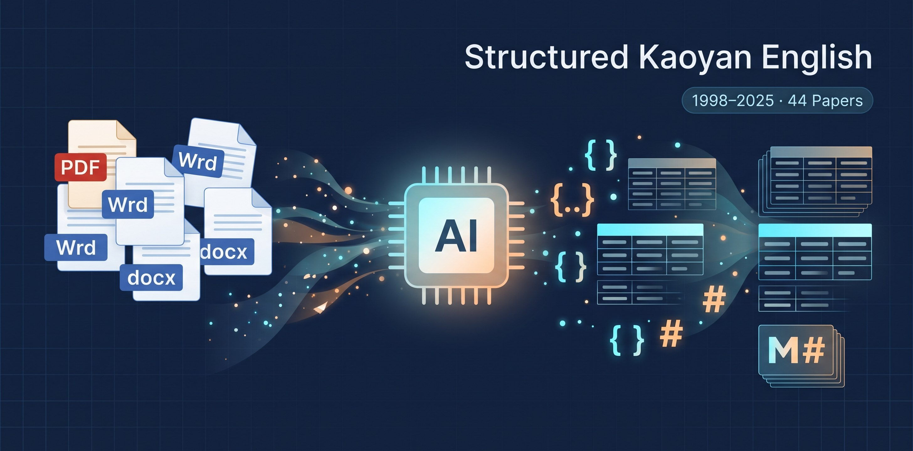

  

# Structured-Kaoyan-English (考研英语结构化数据集)

**简体中文** | [English](README.en.md)

本项目将历年考研英语真题（1998–2025 年，涵盖英语一与英语二）及详尽解析，从传统的扫描版 PDF 和非结构化文档中全面**数字化与结构化**，旨在为个人备考、AI 辅助学习、大模型微调及 RAG 知识库构建提供开箱即用的高可用数据基建。

## 🌟 项目初衷

市面上的考研英语资料大多停留在排版混乱的 Word 或是无法直接检索的扫描版 PDF，对现代学习方式非常不友好：

- 很难直接喂给大模型做错题分析与长难句拆解；

- 无法快速构建个人检索知识库或自动化复盘流程。

因此，我利用智谱周末发放的 3 亿 的 **GLM-5.3-Flash**  Token 配合自动化脚本，将历年考研真题与解析清洗重构成**结构化 JSON 题库**与**排版规整的 Markdown 解析文档**。希望让每一位考研同学或开发者能够零门槛调用真题数据，结合 AI 打造更高效的个性化学习笔记与复盘系统。

## 📦 仓库内容

仓库包含两套互为补充的数据组织形式：

- **`JSON 数据`**：题干、阅读篇章、题号、选项及标准答案严格字段化，专为程序读取、算法评测与题库系统设计。

- **`Markdown 解析`**：包含全文翻译、考点精析、长难句剖析与解题思路，适合人类直接阅读，或作为 RAG（检索增强生成）系统的切片语料。

- **`配套图片`**：完型、阅读或新题型中的关联插图已进行统一命名处理，避免题号覆盖冲突，且文档内的相对引用路径均已校对。

## ⚠️ 数据来源与局限说明

1. **数据来源**：试题文本来源于百度网盘、网络公开备考社区及多份公开发布的历年真题资料；解析部分参考了网络流传的数字化教辅扫描文档。

2. **准确性局限**：尽管在转换过程中结合了大模型与程序清洗，但由于原文扫描件清晰度不一及大模型不可避免的幻觉现象，**无法 100% 保证所有文字、标点及排版毫厘不差**。

3. **欢迎共建**：如果你在做题或使用数据时发现了错别字、漏题或解析偏差，强烈欢迎提交 **Issue** 反馈，或者直接提交 **Pull Request (PR)** 协助修正！

## ⚖️ 许可与版权声明 (License & Disclaimer)

本仓库为**混合内容数据集**：试题与解析的权利状况不同，任何单一标准开源许可证都无法同时覆盖，因此采用**分层授权**，完整法律条款以 **[LICENSE.md](LICENSE.md)** 为准。摘要如下：

| 内容层级       | 具体范围                                                                             | 许可方式                                        |
| ---------- | -------------------------------------------------------------------------------- | ------------------------------------------- |
| **试题数据**   | 题干、阅读篇章、选项、标准答案、试题配图（即 JSON 中 `explanation` 以外的全部题目字段，及 Markdown 中的试题正文）         | 🟢 **自由使用**：可用于任何目的（含商业用途）                  |
| **解析数据**   | JSON 中的 `explanation` 字段、Markdown 中 `
` 折叠块内的解析内容（全文翻译、考点精析、长难句剖析、解题思路等） | 🔴 **CC BY-NC 4.0，仅限非商业用途**：著作权归原作者 / 出版方所有 |
| **项目原创部分** | 数据结构设计、字段规范、文档与转换方案                                                              | CC BY 4.0                                   |

- **解析数据为何禁商用**：解析内容整理自网络流传的第三方数字化教辅资料，著作权归原作者 / 出版方所有，本项目未获商业授权，**无权许可任何商用行为**。解析数据仅供个人学习、学术交流与研究使用，**严禁用于任何形式的商业盈利行为**（包括付费课程、商业题库、商业 App 等）。若无法将解析与试题分离使用，请将文件**整体按非商业条款**执行。
- **侵权下线说明**：本项目秉持开源交流初衷，若相关权利方认为收录内容侵犯了您的合法权益，请提交 Issue 并附权利证明，确认后将在第一时间下线删除争议内容。
- **免责提示**：仓库内容按"现状"提供，不构成官方资料；数据准确性局限详见上文「数据来源与局限说明」。

## 💖 支持项目

如果这份数字化数据在你的考研复习路上提供了便利，或者为你的 AI 实验节省了清洗数据的时间，请顺手给这个仓库点一个 **Star ⭐️**！这对我来说是最大的鼓励与支持。祝愿各位考研顺利，一战成硕！
